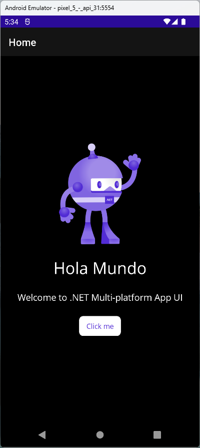

# MauiMultilanguageApp
Maui multilanguage app for testing the issue https://github.com/dotnet/maui/issues/6076

The current status is that the AL1012 is not appearing anymore on Visual Studio for windows if the current setting is set to the csproj file

```
<GenerateSatelliteAssembliesForCore>true</GenerateSatelliteAssembliesForCore>
```

Now the issue is that on Android and Windows the translation works fine but not for iOS as can see in the following images.
As suggested by Gerald Versluis on the issue https://github.com/dotnet/maui/issues/5595 I've added the culture info:

```csharp
Thread.CurrentThread.CurrentCulture = culture;
Thread.CurrentThread.CurrentUICulture = culture;
CultureInfo.DefaultThreadCurrentCulture = culture;
CultureInfo.DefaultThreadCurrentUICulture = culture;
```

But as you can see in the following images on iPhone does not take effect.
## Android



## Windows


## iPhone

